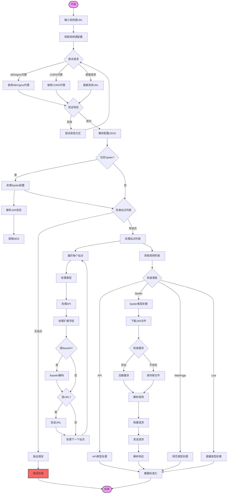
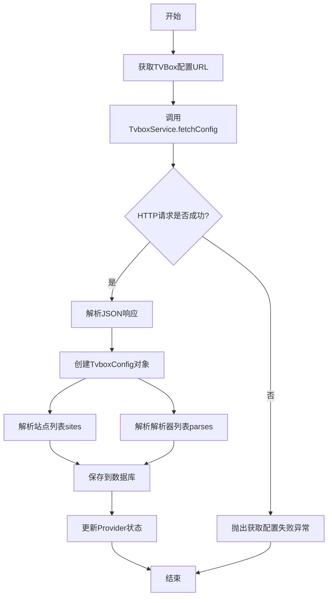
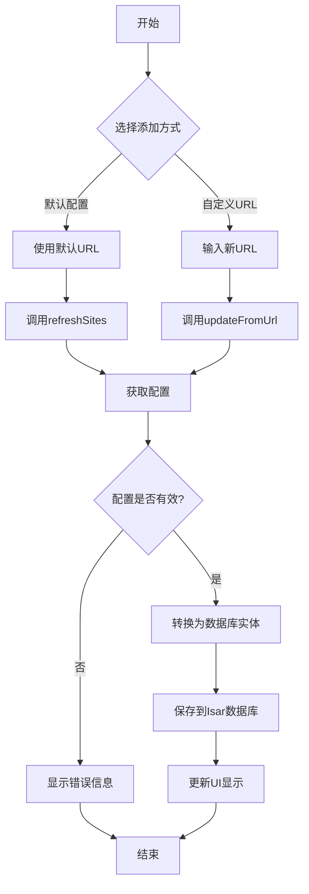
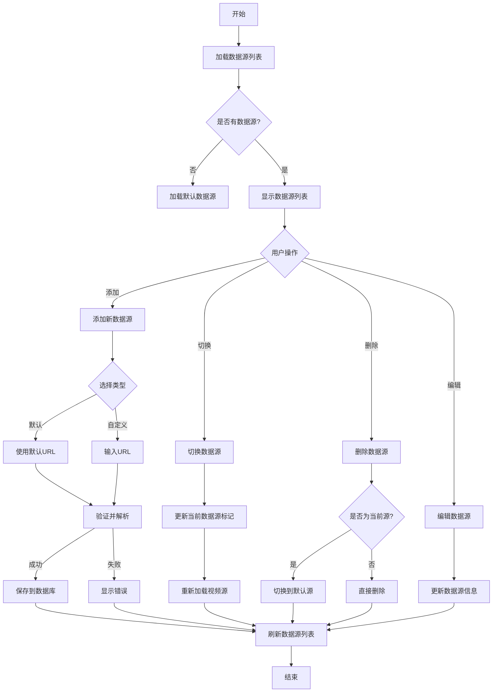
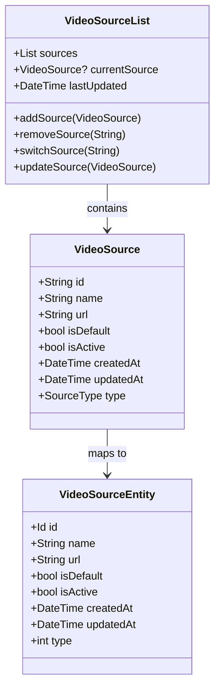
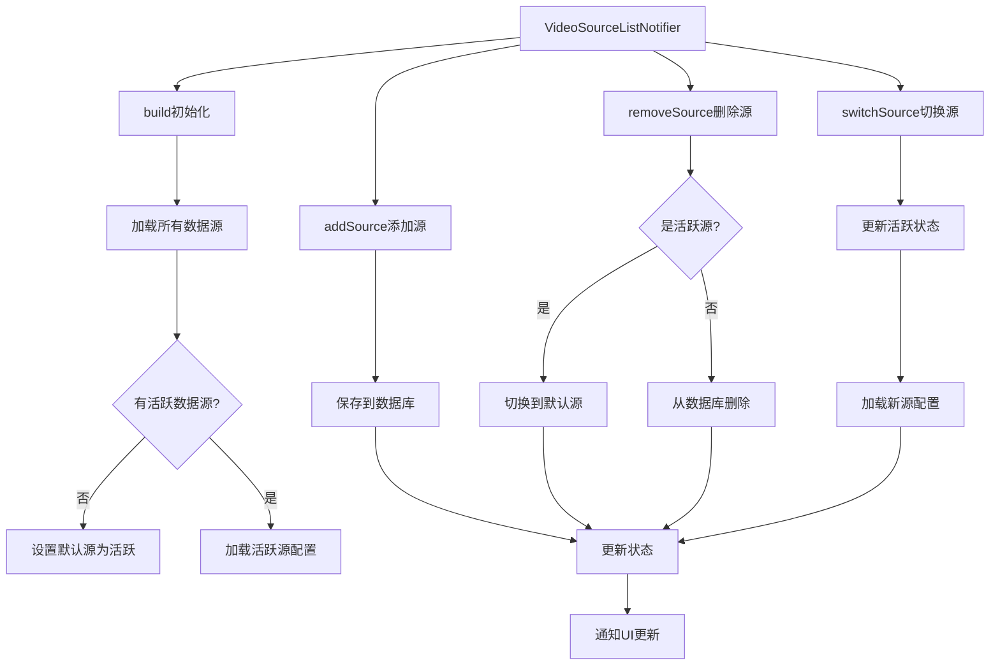
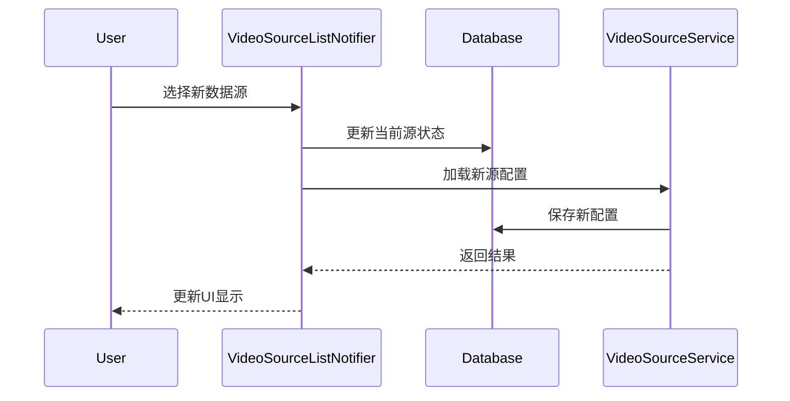
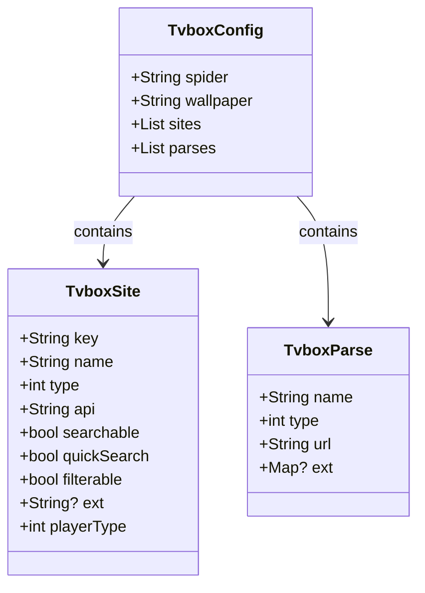
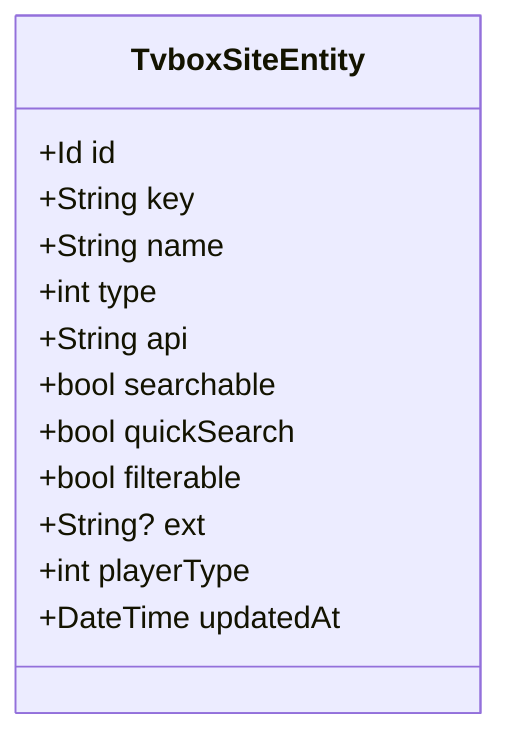
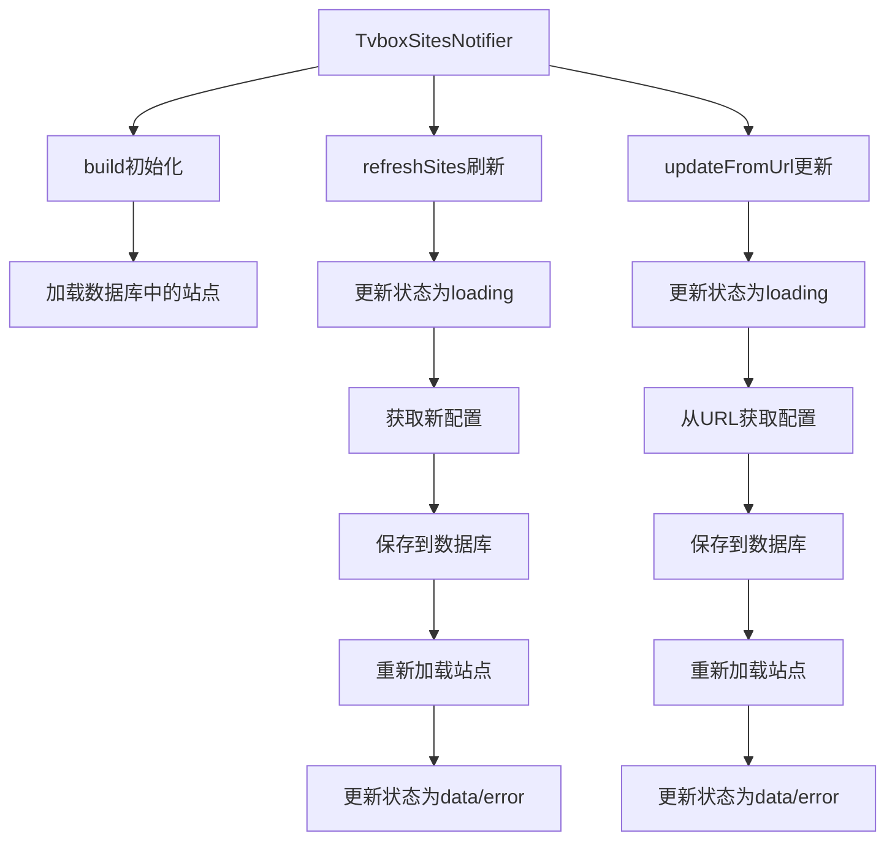

# LifeTV 视频源解析流程图

## 解析逻辑流程图

## 流程说明

### 1. 初始化阶段
- 接收视频源 URL
- 开始获取配置过程

### 2. 配置获取流程
- 多级请求尝试（AllOrigins代理 -> CORS代理 -> 直接请求）
- 响应验证
- 配置解析

### 3. Spider配置处理
- 检查是否包含 Spider 配置
- 解析 JAR 文件信息
- 提取 MD5 校验值

### 4. 站点列表处理
- 验证站点列表存在
- 遍历处理每个站点
- 类型转换和标准化
- 处理 API 和扩展字段

### 5. 视频获取流程
- 根据类型分发到不同处理器
- API 类型直接请求
- Spider 类型需要额外处理
- WebPage 类型网页解析
- Live 类型直播源处理

### 6. Spider视频处理
- JAR 文件下载和缓存管理
- 规则解析
- 请求构建和发送
- 响应解析

### 7. 数据标准化
- 统一数据格式
- 字段映射和转换
- 返回标准化结果

### 8. 错误处理
- 各阶段错误捕获
- 错误信息标准化
- 错误恢复机制 

## TVBox配置解析流程

## 数据源添加流程

## 数据源列表管理流程

### 数据源管理数据结构

### 数据源状态管理流程

## 数据源切换时序图

## 数据结构

### TvboxConfig

### 数据库实体

## 状态管理流程

